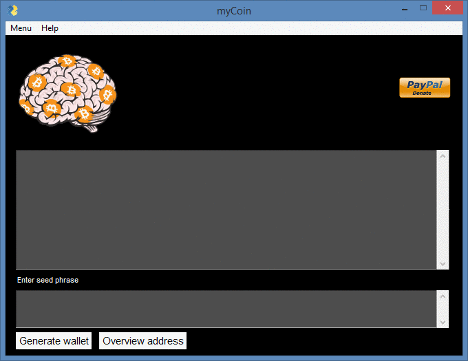
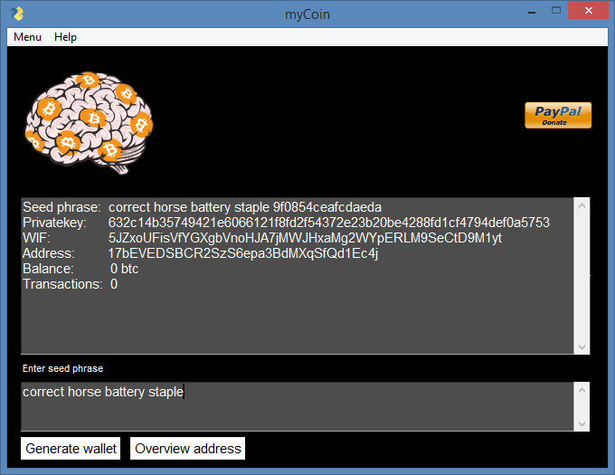
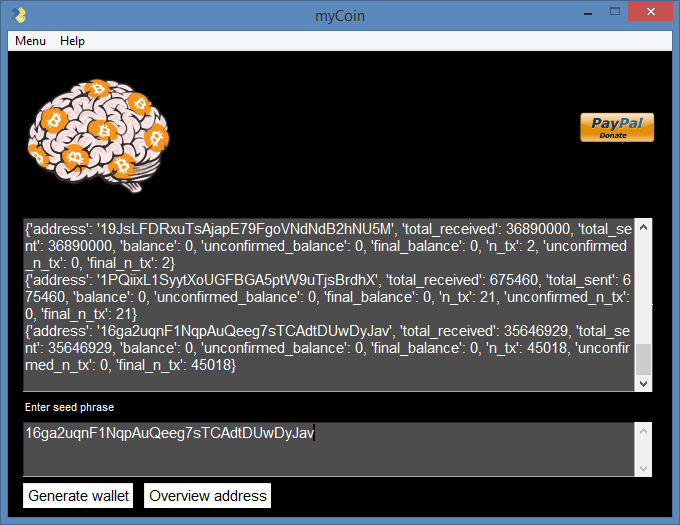

# my Coin Bitcoin brainwallet 

[](https://www.python.org/)

[](https://github.com/adrijano/myCoin-Brainwallet/)

[](https://github.com/adrijano/myCoin-Brainwallet/graphs/commit-activity)




[](https://www.paypal.com/donate/?cmd=_s-xclick&hosted_button_id=PFB6A6HLAQHC2&source=url)  [](https://commerce.coinbase.com/checkout/149a6235-ec7e-4d3b-a1ae-b08c4f08b4f6)

# If you like it give it a star

[](https://github.com/adrijano/myCoin-Brainwallet/)

**Programmed in Python | PySimpleGUI**

# How it works
```
From seed phrase and salt everytime create different bitcoin
privatekey and then convert it to Wallet Interchange Format key (WiF) format, 
which is a Base-58 form for the random key. 
This is the format that is stored in the Bitcoin Wallet. 


For example a sample private key is generated from:

seed phrase and salt:   correct horse battery staple
9f0854ceafcdaeda

Privatekey:  

632c14b35749421e6066121f8fd2f54372e23b20be4288fd1cf4794def0a5753


We then convert this into WiF format (Base-58):

5JZxoUFisVfYGXgbVnoHJA7jMWJHxaMg2WYpERLM9SeCtD9M1yt

This can be stored in a Bitcoin wallet. Next we can take then private key and a 
hash value, and covert it into a useable Bitcoin address, such as:

17bEVEDSBCR2SzS6epa3BdMXqSfQd1Ec4j

The format of the keys is defined below, where we create a 256-bit private key 
and convert this to a WiF private key. Next we generate a 512-bit public key, 
and then take a 160-bit RIPEM-160 hash and convert to a Bitcoin address.
```
### Address overview
```
Paste address and click Overview address you want.

```
# How to use

### Python3+
```
git clone https://github.com/adrijano/myCoin-Brainwallet.git

cd myCoin-Brainwallet && pip install -r requirements.txt

python3 myCoin.py
```
## Sample

**myCoin-Wallet is saved in myCoin-Wallet.docx**

```
-------------------------------------------------------------------------------------------------------------------------------

myCoin-Wallet: 

Seed phrase: correct horse battery staple 9f0854ceafcdaeda

Privatekey: 632c14b35749421e6066121f8fd2f54372e23b20be4288fd1cf4794def0a5753

Publickey:  04c742fc44fa02739088ff67fdc2363e8a3d14b1b60e13f30f3a266e5d7ff6d908f1d625c4cbb8ee532307552df1d2e2791723f9a62048c7ec643470d875032d53

WIF:        5JZxoUFisVfYGXgbVnoHJA7jMWJHxaMg2WYpERLM9SeCtD9M1yt

Address:    17bEVEDSBCR2SzS6epa3BdMXqSfQd1Ec4j

Balance:    0 btc

Transactions:  0
-------------------------------------------------------------------------------------------------------------------------------

Wallet: 

Seed phrase: correct horse battery staple fe4aa5d13bfd4e3f

Privatekey: 240dc0a82556215c2dcb1997d45d2b97ac1f7bc168234dc702e27b2448fa54a7

Publickey:  041c4eefce239530de78b59361d6287e8ac183ab69398e8ffa6a3c0501a2de617a420c8ff2edb3bfeab46ca27a1c47ddda915f7e5f262c2a537399d566fd4741df

WIF:        5J6AXRmnSU5P3cNSxaCzgaeby5pkKew2sCpF3Q8SsBHqnp7ftZX

Address:    1DownQ4WFcnc9RtC4AKHcwa7Eyj15vFVbK

Balance:    0 btc

Transactions:  0
-------------------------------------------------------------------------------------------------------------------------------

```



## Donations
If you would like to support me, donations are very welcome.

```
You can use Paypal to donate using your own credit card. 
The payment is processed by PayPal but you don't need to have a
PayPal account or sign-up for one if you are paying by credit card.

You can also use your own Paypal account to donate.

You can use also donate Bitcoin, Bitcoin Cash, Dai, Ethereum, Litecoin and USD Coin.
```
[](https://www.paypal.com/donate/?cmd=_s-xclick&hosted_button_id=PFB6A6HLAQHC2&source=url)  [](https://commerce.coinbase.com/checkout/149a6235-ec7e-4d3b-a1ae-b08c4f08b4f6)


# Disclaimer


**The code within this repository comes with no guarantee, the use of this code is your responsibility. I take NO responsibility and/or liability for how you choose to use any of the source code available here. By using any of the files available in this repository, you understand that you are AGREEING TO USE AT YOUR OWN RISK. Once again, ALL files available here are for EDUCATION and/or RESEARCH purposes ONLY.**


[](https://github.com/adrijano/myCoin-Brainwallet/)

